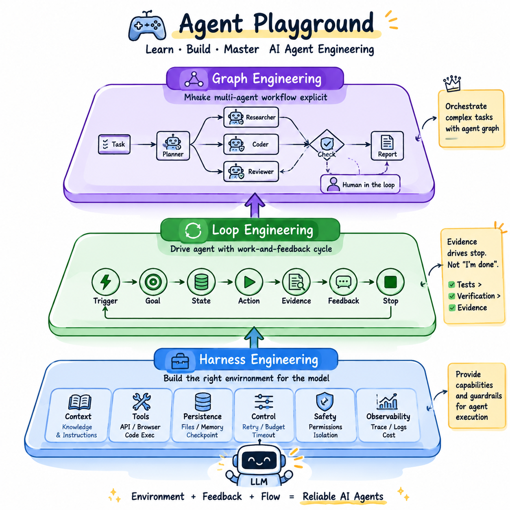

# Agent Incident Simulator

[English](./README.en.md)

一个用于学习如何响应 AI Agent 事故的交互式模拟器。



包含 16 个渐进式事故工单（INC-000…015），涵盖 LLM、Harness、Loop、Graph、Reliability 五层工程。调查现场、诊断根因、选择干预方案、运行确定性 Monte Carlo 验证，并关闭工单以解锁下一阶段。

**在线预览：** https://flingjie.github.io/AgentPlaygroud/

## 本地开发

```bash
npm install
npm run dev
npm run test
npm run build
```

## 部署

每次推送到 `main` 分支时，GitHub Actions 会自动构建 `dist` 并部署到 GitHub Pages。

## 技术栈

- React 19 + TypeScript 5
- React Router 7（HashRouter）
- Tailwind CSS 4
- Zustand（进度状态）
- Vite 7
- Vitest + Testing Library
